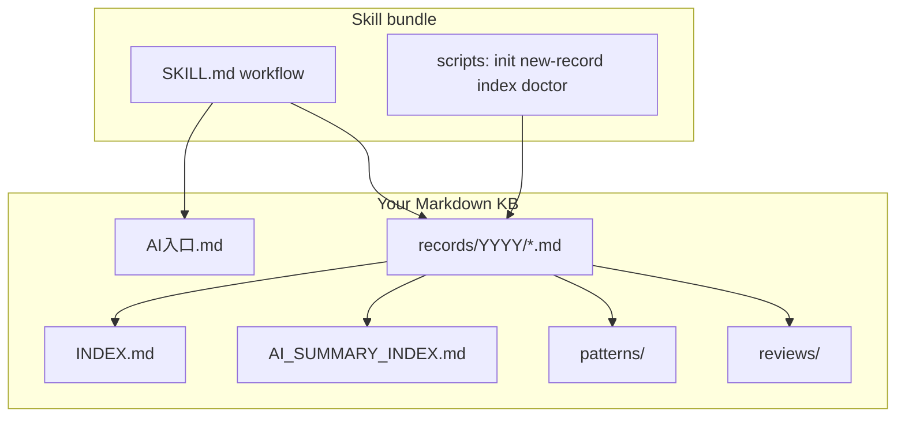

# Problem Solution Recorder

[](./LICENSE)
[](./skill/problem-solution-recorder/SKILL.md)


[中文说明](README.zh-CN.md)

An agent skill for maintaining a configurable **problem–solution knowledge base** in Markdown (outside the skill). It helps agents archive solved incidents, keep human and AI indexes, search past fixes, distill reusable patterns, and run periodic reviews.

## Quick start

```bash
git clone https://github.com/rongyi/problem-solution-recorder-oss.git
cd problem-solution-recorder-oss

# 1) Create a knowledge base from the bundled template
skill/problem-solution-recorder/scripts/init-kb.sh "$HOME/problem-solution-kb"
export PROBLEM_SOLUTION_KB_ROOT="$HOME/problem-solution-kb"

# 2) (Optional) Install the skill into local tool directories
skill/problem-solution-recorder/scripts/install.sh --symlink --codex --claude

# 3) Validate
skill/problem-solution-recorder/scripts/validate-skill.sh
skill/problem-solution-recorder/scripts/smoke-test.sh
```

## How it works



The skill is a **workflow wrapper**: your live KB stays a normal git repo; the skill tells agents how to resolve `PROBLEM_SOLUTION_KB_ROOT`, which files to read first, and how to update indexes safely.

## What this repository contains

```text
skill/problem-solution-recorder/     # publishable skill folder (ClawdHub / local install)
examples/minimal-knowledge-base/     # browsable mirror of the bundled template + sample data
```

## Positioning

| Approach | Problem Solution Recorder |
| --- | --- |
| Ad-hoc Markdown notes | Structured records, dual indexes, optional patterns/reviews |
| Storing history inside the skill | KB stays separate; skill stays small and publishable |
| Heavy proprietary ticket DB | Plain Markdown, git-friendly, agent-readable |

## Use cases

- Archive CLI, MCP, API, permission, dependency, build, or AI-tool issues with evidence.
- Preserve root cause, failed attempts, final fix, and verification.
- Maintain `INDEX.md` and compact `AI_SUMMARY_INDEX.md`.
- Search past incidents before repeating work.
- Distill reusable troubleshooting patterns under `patterns/`.
- Generate daily / weekly / monthly retrospectives under `reviews/`.
- Print copyable prompts and completion-hook rules for Codex, Claude Code, OpenClaw, Cursor, and similar tools.

## Configure a knowledge base

Resolution order:

1. `PROBLEM_SOLUTION_KB_ROOT`
2. `.problem-solution-root` in the current project or a parent directory
3. `$XDG_CONFIG_HOME/problem-solution-recorder/root`
4. `~/.config/problem-solution-recorder/root`
5. Ask the user or initialize a new knowledge base

```bash
export PROBLEM_SOLUTION_KB_ROOT="$HOME/problem-solution-kb"
# or per project:
printf '%s\n' "$HOME/problem-solution-kb" > .problem-solution-root
```

## Initialize a new knowledge base

```bash
skill/problem-solution-recorder/scripts/init-kb.sh "$HOME/problem-solution-kb"
```

Then set `PROBLEM_SOLUTION_KB_ROOT` or `.problem-solution-root`.

## Install locally

```bash
skill/problem-solution-recorder/scripts/install.sh --copy --all
```

Targets:

- `~/.codex/skills/problem-solution-recorder`
- `~/.claude/skills/problem-solution-recorder`
- `~/.cursor/skills-cursor/problem-solution-recorder`
- `~/.agents/skills/problem-solution-recorder`
- `~/.openclaw/skills/problem-solution-recorder`

Flags:

- `--symlink` — link to this repo during development.
- `--dry-run` — print actions without changing files.
- `--uninstall` — remove installs **only** if they are symlinks to this skill or copies stamped with `.psr-installed-from` from this installer.
- `--skip-validate` — skip `validate-skill.sh` before install (emergency only).

## Validate

```bash
skill/problem-solution-recorder/scripts/validate-skill.sh
skill/problem-solution-recorder/scripts/smoke-test.sh
skill/problem-solution-recorder/scripts/doctor-local.sh
```

## AI-friendly helper scripts

```bash
skill/problem-solution-recorder/scripts/print-prompt.sh global-rule
skill/problem-solution-recorder/scripts/print-prompt.sh hook
skill/problem-solution-recorder/scripts/new-record.sh "Issue title"
skill/problem-solution-recorder/scripts/update-ai-summary-index.sh
```

The generated knowledge base includes:

- `AI入口.md` — first file an agent should read
- `AI记录提示词.md` — copyable prompts
- `AI工具记录规则.md` — global rule snippets and post-solve protocol

## Publish to ClawdHub

Install the **ClawHub** CLI (`clawhub`), authenticate, accept license terms on [clawhub.ai](https://clawhub.ai) if prompted, then publish **only** the skill folder.

Each publish must bump the `version` field in `skill/problem-solution-recorder/SKILL.md` (duplicate versions are rejected). Bundle size is capped (registry limit, typically on the order of tens of MB).

```bash
clawhub publish ./skill/problem-solution-recorder \
  --slug problem-solution-recorder \
  --name "Problem Solution Recorder" \
  --version 0.1.0 \
  --tags "knowledge-base,debugging,markdown,agents" \
  --changelog "Initial public release"
```

If the CLI reports missing license acceptance, retry after accepting terms in the browser, or use any documented `--accept-license` / equivalent flag shipped by your `clawhub` version.

See [PUBLISHING.md](./PUBLISHING.md) for a full checklist.

## GitHub layout

- Publish the **whole repository** to GitHub for docs, CI, and examples.
- Publish **only** `skill/problem-solution-recorder` to skill registries.

## Screenshots

_Add screenshots or a short screen recording under `docs/media/` after the first public release (optional)._

## GitHub topics (suggested)

`agent-skills` `markdown` `knowledge-base` `debugging` `mcp` `codex` `claude` `cursor` `openclaw` `devtools`

## Safety

Agents should redact API keys, tokens, cookies, passwords, private keys, authorization codes, and bearer tokens. Use `[REDACTED]` for secret values.

## Contributing

See [CONTRIBUTING.md](./CONTRIBUTING.md) and [CODE_OF_CONDUCT.md](./CODE_OF_CONDUCT.md).

## License

MIT
