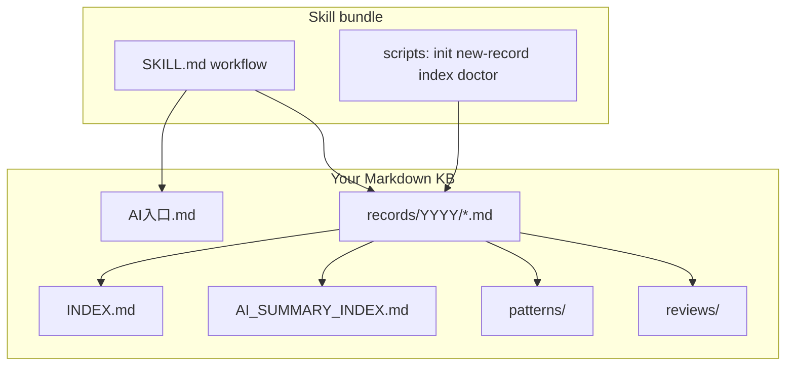

# Problem Solution Recorder

> Markdown-native problem solving memory for AI tools and independent developers.

[](./LICENSE)
[](./skill/problem-solution-recorder/SKILL.md)


<details>
<summary><strong>中文说明（点击展开，无需跳转）</strong></summary>

## 中文说明

面向 AI 编程助手的 **Agent Skill**：在 skill 之外维护一套可配置的 **问题-解决 Markdown 知识库**，用于归档已解决问题、保留排障证据、维护人类索引与 AI 摘要索引、检索历史案例、沉淀可复用排障模式，以及做周期性复盘。

### 亮点

- 用纯 Markdown 记录已解决问题。
- 同时维护人类索引 `INDEX.md` 和 AI 索引 `AI_SUMMARY_INDEX.md`。
- 支持通过环境变量、项目标记或 XDG 配置定位知识库根目录。
- 提供记录、索引、校验、本地安装的一组辅助脚本。
- 自带知识库密钥扫描，便于提交和发布前检查敏感内容。

### 快速开始

```bash
git clone https://github.com/rongyishuaige7/problem-solution-recorder-oss.git
cd problem-solution-recorder-oss

# 1. 从内置模板创建知识库
skill/problem-solution-recorder/scripts/init-kb.sh "$HOME/problem-solution-kb"
export PROBLEM_SOLUTION_KB_ROOT="$HOME/problem-solution-kb"

# 2. 可选：安装到本地 AI 工具目录
skill/problem-solution-recorder/scripts/install.sh --symlink --codex --claude

# 3. 校验
skill/problem-solution-recorder/scripts/validate-skill.sh
skill/problem-solution-recorder/scripts/smoke-test.sh
skill/problem-solution-recorder/scripts/check-kb.sh "$PROBLEM_SOLUTION_KB_ROOT"
```

### 工作原理

Skill 只提供 **工作流与脚本**；你的真实知识库仍是独立 git 仓库。Agent 先解析 `PROBLEM_SOLUTION_KB_ROOT`，再读 `AI入口.md`，按模板写入 `records/`，并更新 `INDEX.md` 与 `AI_SUMMARY_INDEX.md`。

### 仓库结构

```text
skill/problem-solution-recorder/     # 可发布的 skill 目录（本地或注册表安装）
examples/minimal-knowledge-base/     # 与内置模板同步的示例（含样例记录）
```

### 知识库根目录解析顺序

1. 环境变量 `PROBLEM_SOLUTION_KB_ROOT`
2. 当前或上级目录中的 `.problem-solution-root`
3. `$XDG_CONFIG_HOME/problem-solution-recorder/root`
4. `~/.config/problem-solution-recorder/root`
5. 询问用户或运行 `init-kb.sh` 初始化

### 本地安装

```bash
skill/problem-solution-recorder/scripts/install.sh --copy --all
```

常用参数：`--symlink`（开发联调）、`--dry-run`、`--uninstall`（仅删除由本安装器创建或标记的目录、或指向本 skill 的符号链接）、`--skip-validate`（不推荐）。

### 安全

禁止写入真实 API key、token、cookie、密码、私钥等；统一使用 `[REDACTED]`。

`check-kb.sh` 会扫描 Markdown 知识库中的疑似密钥，建议在提交、分享或重新生成 AI 摘要索引前运行。

</details>

An agent skill for maintaining a configurable **problem–solution knowledge base** in Markdown outside the skill. It helps agents archive solved incidents, keep human and AI indexes, search past fixes, distill reusable patterns, and run periodic reviews.

## Highlights

- Records solved issues in plain Markdown.
- Keeps a human `INDEX.md` and a compact `AI_SUMMARY_INDEX.md`.
- Resolves the knowledge base root through env, project marker, or XDG config.
- Ships helper scripts for recording, indexing, validation, and local installs.
- Adds a secret scanner for knowledge base content before sharing or publishing.

## Quick start

```bash
git clone https://github.com/rongyishuaige7/problem-solution-recorder-oss.git
cd problem-solution-recorder-oss

# 1) Create a knowledge base from the bundled template
skill/problem-solution-recorder/scripts/init-kb.sh "$HOME/problem-solution-kb"
export PROBLEM_SOLUTION_KB_ROOT="$HOME/problem-solution-kb"

# 2) (Optional) Install the skill into local tool directories
skill/problem-solution-recorder/scripts/install.sh --symlink --codex --claude

# 3) Validate
skill/problem-solution-recorder/scripts/validate-skill.sh
skill/problem-solution-recorder/scripts/smoke-test.sh
```

## How it works



The skill is a **workflow wrapper**: your live KB stays a normal git repo; the skill tells agents how to resolve `PROBLEM_SOLUTION_KB_ROOT`, which files to read first, and how to update indexes safely.

## What this repository contains

```text
skill/problem-solution-recorder/     # publishable skill folder (local install or registries)
examples/minimal-knowledge-base/     # browsable mirror of the bundled template + sample data
```

## Positioning

| Approach | Problem Solution Recorder |
| --- | --- |
| Ad-hoc Markdown notes | Structured records, dual indexes, optional patterns/reviews |
| Storing history inside the skill | KB stays separate; skill stays small and publishable |
| Heavy proprietary ticket DB | Plain Markdown, git-friendly, agent-readable |

## Use cases

- Archive CLI, MCP, API, permission, dependency, build, or AI-tool issues with evidence.
- Preserve root cause, failed attempts, final fix, and verification.
- Maintain `INDEX.md` and compact `AI_SUMMARY_INDEX.md`.
- Search past incidents before repeating work.
- Distill reusable troubleshooting patterns under `patterns/`.
- Generate daily / weekly / monthly retrospectives under `reviews/`.
- Print copyable prompts and completion-hook rules for Codex, Claude Code, OpenClaw, Cursor, and similar tools.

## Configure a knowledge base

Resolution order:

1. `PROBLEM_SOLUTION_KB_ROOT`
2. `.problem-solution-root` in the current project or a parent directory
3. `$XDG_CONFIG_HOME/problem-solution-recorder/root`
4. `~/.config/problem-solution-recorder/root`
5. Ask the user or initialize a new knowledge base

```bash
export PROBLEM_SOLUTION_KB_ROOT="$HOME/problem-solution-kb"
# or per project:
printf '%s\n' "$HOME/problem-solution-kb" > .problem-solution-root
```

## Initialize a new knowledge base

```bash
skill/problem-solution-recorder/scripts/init-kb.sh "$HOME/problem-solution-kb"
```

Then set `PROBLEM_SOLUTION_KB_ROOT` or `.problem-solution-root`.

## Install locally

```bash
skill/problem-solution-recorder/scripts/install.sh --copy --all
```

Targets:

- `~/.codex/skills/problem-solution-recorder`
- `~/.claude/skills/problem-solution-recorder`
- `~/.cursor/skills-cursor/problem-solution-recorder`
- `~/.agents/skills/problem-solution-recorder`
- `~/.openclaw/skills/problem-solution-recorder`

Flags:

- `--symlink` — link to this repo during development.
- `--dry-run` — print actions without changing files.
- `--uninstall` — remove installs **only** if they are symlinks to this skill or copies stamped with `.psr-installed-from` from this installer.
- `--skip-validate` — skip `validate-skill.sh` before install (emergency only).

## Validate

```bash
skill/problem-solution-recorder/scripts/validate-skill.sh
skill/problem-solution-recorder/scripts/smoke-test.sh
skill/problem-solution-recorder/scripts/check-kb.sh "$PROBLEM_SOLUTION_KB_ROOT"
skill/problem-solution-recorder/scripts/doctor-local.sh
```

## AI-friendly helper scripts

```bash
skill/problem-solution-recorder/scripts/print-prompt.sh global-rule
skill/problem-solution-recorder/scripts/print-prompt.sh hook
skill/problem-solution-recorder/scripts/new-record.sh "Issue title"
skill/problem-solution-recorder/scripts/update-ai-summary-index.sh
skill/problem-solution-recorder/scripts/check-kb.sh "$PROBLEM_SOLUTION_KB_ROOT"
```

The generated knowledge base includes:

- `AI入口.md` — first file an agent should read
- `AI记录提示词.md` — copyable prompts
- `AI工具记录规则.md` — global rule snippets and post-solve protocol

## GitHub layout

- Publish the **whole repository** to GitHub for docs, CI, and examples.
- Publish **only** `skill/problem-solution-recorder` to skill registries.

## Screenshots

_Add screenshots or a short screen recording under [`docs/media/`](docs/media/) after the first public release (optional)._

## GitHub topics (suggested)

`agent-skills` `markdown` `knowledge-base` `debugging` `mcp` `codex` `claude` `cursor` `openclaw` `devtools`

## Safety

Agents should redact API keys, tokens, cookies, passwords, private keys, authorization codes, and bearer tokens. Use `[REDACTED]` for secret values.

`check-kb.sh` scans your Markdown knowledge base for likely leaked secrets before sharing, committing, or regenerating indexes.

## Contributing

See [CONTRIBUTING.md](./CONTRIBUTING.md) and [CODE_OF_CONDUCT.md](./CODE_OF_CONDUCT.md). Maintainer release and registry notes: [PUBLISHING.md](./PUBLISHING.md).

## License

MIT
